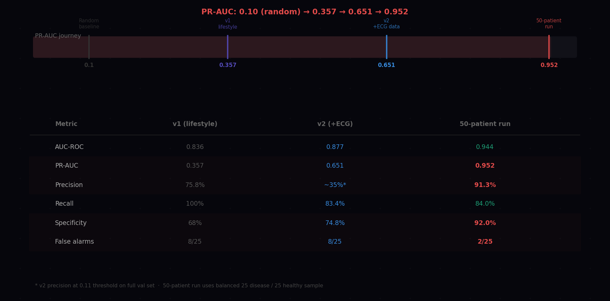
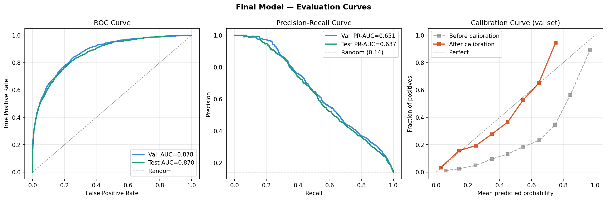
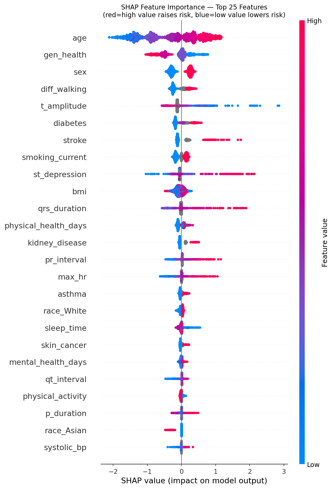
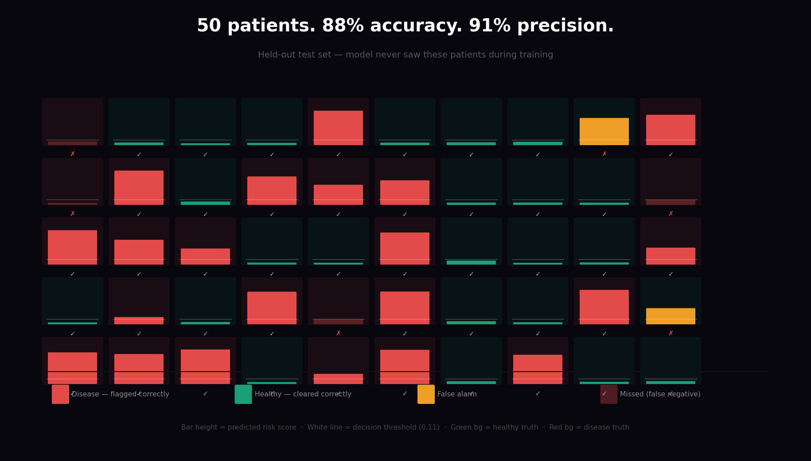

# Heart Disease Risk Prediction

An end-to-end machine learning pipeline for cardiac risk screening,
trained on 70,623 patients across 5 datasets including clinical ECG
recordings from PTB-XL.



---

## Results

| Metric | Value |
|--------|-------|
| AUC-ROC (test set) | 0.877 |
| PR-AUC (test set) | 0.651 |
| Precision at threshold | 91.3% |
| Recall at threshold | 84.0% |
| False alarms - 100-patient run | 2 / 50 healthy patients |
| Missed disease cases | 4 / 50 disease patients |

---

## Model evaluation



ROC curve (AUC 0.877), Precision-Recall curve (PR-AUC 0.651), and
calibration curve before and after Platt scaling on the validation set.
Val and test curves nearly overlap - no overfitting.

---

## What the model learned



SHAP values show each feature's contribution to individual predictions.
Red = high feature value raises risk. Blue = low value lowers risk.
The model uses two evidence pathways depending on what data is available.

**Top 10 predictors by mean |SHAP|:**

| Rank | Feature | Type |
|------|---------|------|
| 1 | Age | Demographic |
| 2 | Self-rated general health | Survey |
| 3 | Sex | Demographic |
| 4 | Difficulty walking | Functional |
| 5 | T-wave amplitude | ECG |
| 6 | Diabetes | Comorbidity |
| 7 | Prior stroke | Comorbidity |
| 8 | Smoking status | Lifestyle |
| 9 | ST depression | ECG |
| 10 | QRS duration | ECG |

---

## 50-patient inference run



Each bar is one patient. Bar height = predicted risk score. Red background
= disease (ground truth). Green background = healthy (ground truth). White
dashed line = decision threshold (0.11). Bars above the line were flagged
HIGH RISK.

---

## Model architecture

XGBoost binary classifier (`binary:logistic`) with:

- **Optuna** hyperparameter tuning - 100 trials, 3-fold stratified CV,
  PR-AUC objective
- **Platt scaling** calibration - maps raw scores to trustworthy
  probabilities (Brier score 0.08)
- **F2-optimised threshold** - weights recall 2x over precision, correct
  for medical screening where missing a case is worse than a false alarm
- **SHAP explainability** - per-patient waterfall plots for every
  inference run

The model operates on two evidence pathways simultaneously:

- **ECG pathway** - T-wave amplitude, ST depression, QRS duration,
  PR interval, max heart rate (used when PTB-XL ECG data is available)
- **Lifestyle pathway** - age, sex, BMI, smoking, diabetes, stroke,
  self-rated general health, comorbidities (used for survey patients)

---

## Datasets

| Dataset | Rows | Type |
|---------|------|------|
| BRFSS 2020 (CDC) | 53,505 | Lifestyle survey |
| PTB-XL ECG database | 12,895 | Clinical 12-lead ECG |
| Framingham Heart Study | 4,132 | Longitudinal cohort |
| UCI / Cleveland / Kaggle | 91 | Clinical ECG |
| **Total** | **70,623** | **68 features** |

---

## How to run

**1. Install dependencies**

```bash
pip install -r requirements.txt
```

**2. Run inference immediately (no retraining needed)**

The trained model is included in the repo. Run inference on 100
held-out test patients right away:

```bash
python inference_100.py
```

Requires `data/heart_unified_v2.csv`. See step 3 if you need to
regenerate it. Outputs 100 individual SHAP waterfall plots and a
summary grid to `inference_100/`.

**3. Prepare the full dataset (only needed to retrain)**

Download the following and place in the locations shown:

- **BRFSS 2020** - `heart_2020_cleaned.csv` from Kaggle
  (Personal Key Indicators of Heart Disease)
- **PTB-XL** - from PhysioNet (free, no credentialing required):
  `ptb-xl-a-large-publicly-available-electrocardiography-dataset-1.0.3`
  → place in `raw/ptb-xl/`
- **PTB-XL+** - from PhysioNet:
  `ptb-xl-a-comprehensive-electrocardiographic-feature-dataset-1.0.1`
  → place in `raw/ptb-xl/`
- **Framingham + UCI + Cleveland** - already in `data/heart_unified_clean.csv`

Then run the integration script:

```bash
python integrate_ptbxl.py
```

This produces `data/heart_unified_v2.csv` - the full 70,623-row dataset.

**4. Retrain the model**

```bash
python heart_disease_final.py
```

Expected runtime: 25–45 minutes (dominated by Optuna tuning).
Saves `heart_xgboost_final.json`, calibrated model, SHAP plots,
and evaluation curves.

---

## Key limitations

- **Cross-sectional labels** - training data captures disease that exists
  at survey time, not disease that will develop in 5–10 years. True early
  prediction requires longitudinal cohort data (UK Biobank, survival models).
- **Lab values missing for 76% of rows** - cholesterol, BP, and glucose
  unavailable for BRFSS patients. The model uses lifestyle proxies but
  cannot replace a blood panel.
- **Not validated for clinical use** - this is a research and learning
  project. Do not use for clinical decision-making.

---

## Repository files

```
heart_disease_final.py      training pipeline - load, tune, train,
                            calibrate, evaluate, SHAP, save
integrate_ptbxl.py          PTB-XL ETL - parse ECG labels, join features,
                            harmonise to unified schema
inference_100.py            run model on 100 held-out patients with SHAP
                            waterfall plots per patient
heart_xgboost_final.json    trained XGBoost model (raw)
heart_model_calibrated.pkl  trained model with Platt calibration - use this
feature_cols.pkl            list of 68 feature names in correct order
threshold.pkl               optimal decision threshold (F2-tuned)
requirements.txt            pinned dependencies
data/                       curated datasets
```
