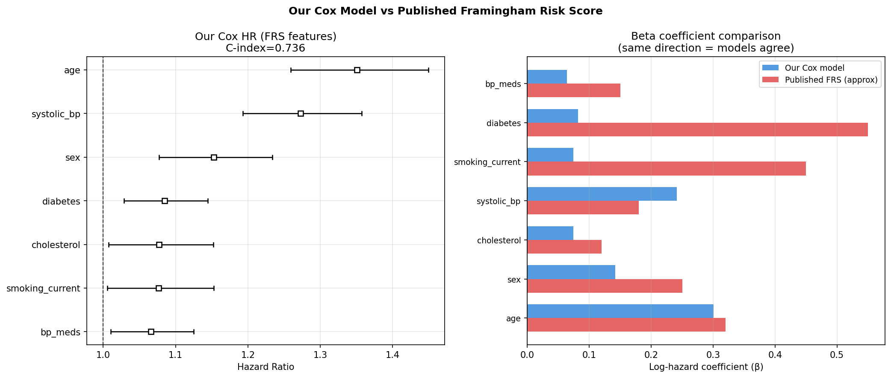
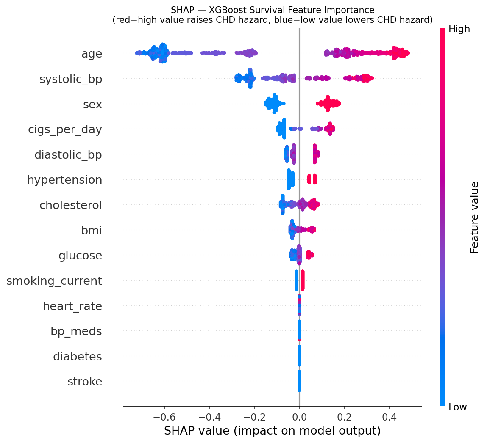
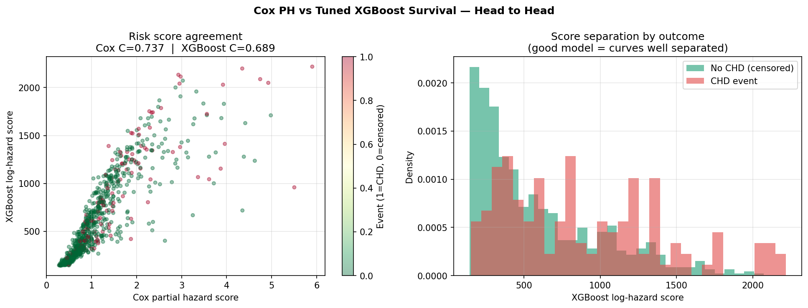
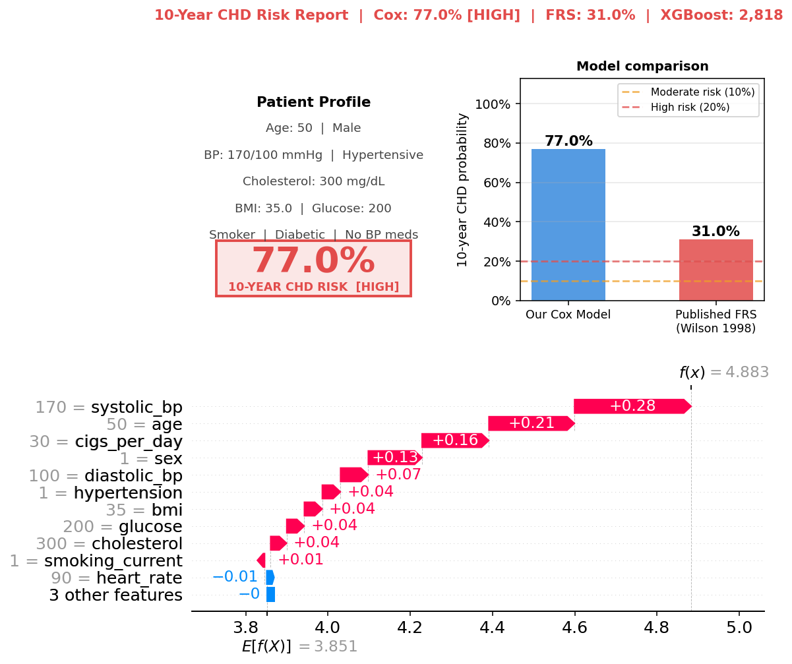

# Heart Disease Risk Prediction

**Live app:** [10-Year Cardiac Risk Calculator](https://cardiacrisk.streamlit.app/)

Two complementary models for cardiac risk assessment, built from scratch:
a cross-sectional XGBoost classifier and a longitudinal Cox survival model.


---

## Part 1 -- XGBoost classifier (cross-sectional)

Predicts whether a patient currently has heart disease.
Trained on 70,623 patients across 5 datasets including clinical ECG
recordings from PTB-XL.

### Results

| Metric | Value |
|--------|-------|
| AUC-ROC (test set) | 0.877 |
| PR-AUC (test set) | 0.651 |
| Precision at threshold | 91.3% |
| Recall at threshold | 84.0% |
| False alarms -- 100-patient run | 2 / 50 healthy patients |
| Missed disease cases | 4 / 50 disease patients |

### Evaluation


ROC curve (AUC 0.877), Precision-Recall curve (PR-AUC 0.651), and
calibration curve before and after Platt scaling on the validation set.
Val and test curves nearly overlap -- no overfitting.

### What the model learned


SHAP values show each feature's contribution to individual predictions.
Red = high feature value raises risk. Blue = low value lowers risk.
The model uses two evidence pathways depending on data availability.

**Top 10 predictors by mean |SHAP|:**

| Rank | Feature | Type |
|------|---------|------|
| 1 | Age | Demographic |
| 2 | Self-rated general health | Survey |
| 3 | Sex | Demographic |
| 4 | Difficulty walking | Functional |
| 5 | T-wave amplitude | ECG |
| 6 | Diabetes | Comorbidity |
| 7 | Prior stroke | Comorbidity |
| 8 | Smoking status | Lifestyle |
| 9 | ST depression | ECG |
| 10 | QRS duration | ECG |

### 50-patient inference run


Each bar is one patient. Bar height = predicted risk score.
Red background = disease (ground truth). Green background = healthy.
White dashed line = decision threshold (0.11).
Bars above the line were flagged HIGH RISK.

### Architecture

XGBoost binary classifier (`binary:logistic`) with:

- **Optuna** hyperparameter tuning -- 100 trials, 3-fold stratified CV,
  PR-AUC objective
- **Platt scaling** calibration -- maps raw scores to calibrated
  probabilities (Brier score 0.08)
- **F2-optimised threshold** -- weights recall 2x over precision,
  correct for screening where missing a case is worse than a false alarm
- **SHAP explainability** -- per-patient waterfall plots for every run

Two evidence pathways run simultaneously:

- **ECG pathway** -- T-wave amplitude, ST depression, QRS duration,
  PR interval, max heart rate (when PTB-XL ECG data is available)
- **Lifestyle pathway** -- age, sex, BMI, smoking, diabetes, stroke,
  self-rated health, comorbidities (for survey-only patients)

### Datasets

| Dataset | Rows | Type |
|---------|------|------|
| BRFSS 2020 (CDC) | 53,505 | Lifestyle survey |
| PTB-XL ECG database | 12,895 | Clinical 12-lead ECG |
| Framingham Heart Study | 4,132 | Longitudinal cohort |
| UCI / Cleveland / Kaggle | 91 | Clinical ECG |
| **Total** | **70,623** | **68 features** |

---

## Part 2 -- Survival analysis (10-year CHD risk)

Predicts who will develop coronary heart disease within 10 years.
Built on the Framingham Heart Study: 4,240 patients, 644 events,
14 clinical features including cholesterol, blood pressure, and glucose.
Validated against the published Framingham Risk Score (Wilson 1998, JAMA).

### Results

| Model | C-index | Notes |
|-------|---------|-------|
| Random baseline | 0.500 | |
| XGBoost survival (untuned) | 0.668 | |
| XGBoost survival (Optuna tuned) | 0.689 | |
| Cox Proportional Hazards | 0.737 | Best model |
| Published Framingham Risk Score | ~0.750 | 1998 benchmark |

Cox outperforms XGBoost on this dataset -- correct and expected.
With 515 training events, gradient boosting cannot learn non-linear
interactions that justify tree depth. Cox's linear assumption is
approximately correct for this population and feature set.

### Framingham Risk Score validation



7 out of 7 coefficient directions match the published Wilson 1998
Framingham Risk Score. Age, sex, cholesterol, systolic BP, smoking,
diabetes, and BP medication all point the same direction as the
original paper. Our Cox model essentially reproduces the 1998 FRS
from the data, with a C-index of 0.737 vs the published ~0.750.

### SHAP feature importance (survival)



Age dominates. Systolic BP is a clear second -- a key difference
from the lifestyle-only classifier where self-rated general health
ranked second. When blood pressure is actually measured, it becomes
the second strongest predictor of cardiac events. This validates
both models simultaneously.

### Model comparison



Left: Cox vs XGBoost risk score agreement on test patients, coloured
by CHD outcome. Right: XGBoost score distribution by outcome showing
separation between CHD and no-CHD groups.

### Patient risk calculator

The pipeline produces a full risk report per patient combining
Cox 10-year probability, published FRS comparison, and SHAP waterfall.



Patient P4: 50-year-old male, heavy smoker, prior stroke, diabetic,
systolic BP 170 mmHg. Cox model: 77% 10-year CHD risk.
Published FRS: 31%. The gap exists because the 1998 point system
caps out at 31% and does not model prior stroke as a feature.
Our Cox model has no cap and includes stroke explicitly.

### Key findings

- Systolic BP is the dominant modifiable risk factor after age --
  consistent with cardiovascular research since 1998
- Smoking dose (cigarettes per day) matters more than binary smoker
  status -- the signal is dose-dependent, not binary
- BMI and resting heart rate add essentially no signal once BP,
  cholesterol, and glucose are in the model
- Adding 7 extra features beyond the core FRS set moves C-index
  by only 0.001 -- the 6 published FRS features capture almost
  all predictable signal in this dataset

---

## How to run

**Install dependencies**

```bash
pip install -r requirements.txt
pip install lifelines
```

**Run the classifier -- no retraining needed**

The trained model is included. Run inference on 100 held-out patients:

```bash
python inference_100.py
```

Requires `data/heart_unified_v2.csv`. Outputs 100 individual SHAP
waterfall plots and a summary grid to `inference_100/`.

**Run the survival analysis**

```bash
python survival_analysis.py
```

Requires `framingham_heart_study.csv` in the repo root.
Outputs saved to `survival_outputs/`.

**Retrain the classifier (optional, ~25-45 minutes)**

```bash
python integrate_ptbxl.py       # build unified dataset from raw sources
python heart_disease_final.py   # retrain with Optuna tuning
```

---

## Repository structure

```
heart_disease_final.py    classifier training pipeline
integrate_ptbxl.py        PTB-XL ECG integration ETL
inference_100.py          100-patient inference with SHAP waterfalls
survival_analysis.py      survival analysis: Cox PH, XGBoost, SHAP,
                          Framingham comparison, patient risk calculator
requirements.txt          pinned dependencies
data/                     curated datasets
models/                   trained classifier model files (ready to use)
assets/                   all evaluation plots, SHAP plots, patient reports
```

---

## Limitations

- **Cross-sectional classifier**: captures disease present at survey
  time, not disease that will develop in future years. The survival
  model addresses this for the Framingham cohort specifically.
- **Lab values**: cholesterol, BP, and glucose are missing for 76%
  of classifier training rows (BRFSS survey patients). The survival
  model has full lab values for all Framingham patients.
- **Survival sample size**: 644 events in 4,240 patients is sufficient
  for Cox but not enough for XGBoost to learn non-linear interactions.
- **Not validated for clinical use**: research and learning project
  only. Do not use for clinical decision-making.
